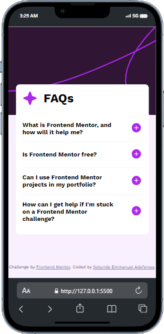
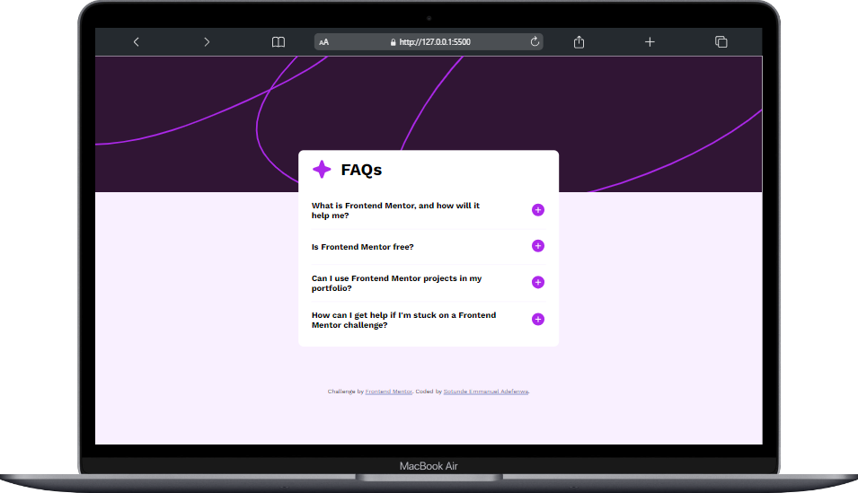

# Frontend Mentor - FAQ accordion solution

This is a solution to the [FAQ accordion challenge on Frontend Mentor](https://www.frontendmentor.io/challenges/faq-accordion-wyfFdeBwBz). Frontend Mentor challenges help you improve your coding skills by building realistic projects.

## Table of contents

- [Overview](#overview)
  - [The challenge](#the-challenge)
  - [Screenshot](#screenshot)
  - [Links](#links)
- [My process](#my-process)
  - [Built with](#built-with)
  - [What I learned](#what-i-learned)
  - [Continued development](#continued-development)
  - [Useful resources](#useful-resources)
- [Author](#author)
- [Acknowledgments](#acknowledgments)

## Overview

### The challenge

Users should be able to:

- Hide/Show the answer to a question when the question is clicked
- Navigate the questions and hide/show answers using keyboard navigation alone
- View the optimal layout for the interface depending on their device's screen size
- See hover and focus states for all interactive elements on the page

### Screenshot

### Links

- Solution URL: [Add solution URL here](https://your-solution-url.com)
- Live Site URL: [JuniorDev Faq Accordion](https://juniordev-faq-accordion.vercel.app/)

## My process

### Built with

- Semantic HTML5 markup
- CSS custom properties
- Flexbox
- Mobile-first workflow
- JavaScript

### What I learned

- I learnt how to implement some accessbility features
- I learnt how to dynamically toggle the aria-expanded attribute in JavaScript

### Continued development

- Accesibility

### Useful resources

- [W3Schools](https://www.w3schools.com/accessibility/) - This helped me to understand accesbility.
- [Crushing it tech](https://www.crushingit.tech/courses/js-accessible-menu/what-we-will-build-and-why-its-important?utm_source=newsletter&utm_medium=email&utm_campaign=how-to-build-accessible-menu-components) - This is an amazing video that taught me how to dynamically toggle the aria-expanded attribute.

## Author

- Frontend Mentor - [Manuelcoder02](https://www.frontendmentor.io/profile/Manuelcoder02)
- Twitter - [juniorDev](https://www.twitter.com/@sotundenuel)

## Acknowledgments

A big thank you to myself for getting this project done and also Special thanks to [George](https://twitter.com/_Annonnymouss_) for always taking time to review my works.
